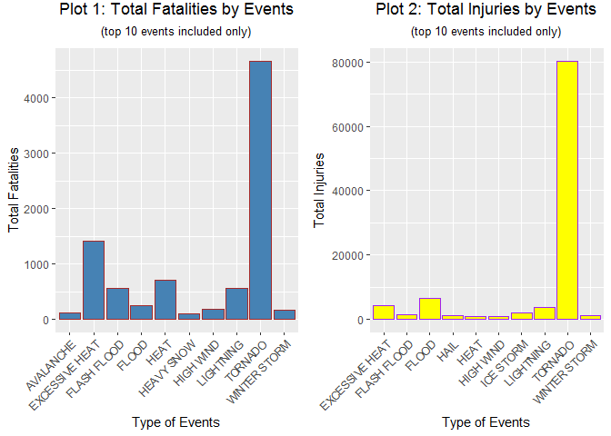
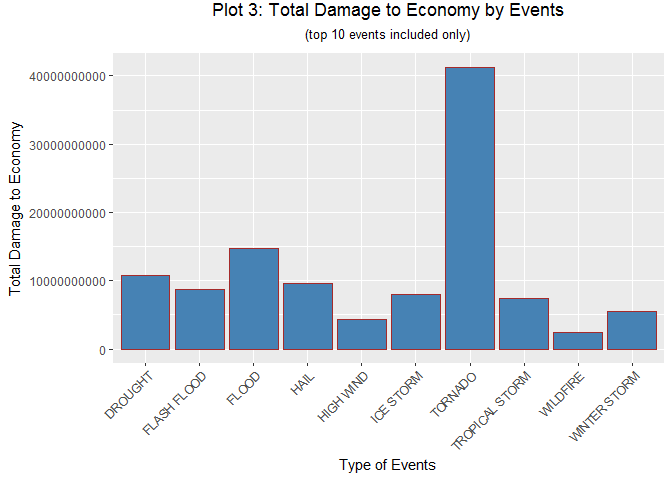

```r
knitr::opts_chunk$set(echo = TRUE)
options(scipen=999)
library(ggplot2)
library(knitr)
library(stringr)
library(plyr)
library(gridExtra)
```

## Synopsis

Storms and other severe weather events can cause both public health and economic problems for communities. This report analyzes the U.S. National Oceanic and Atmospheric Administration's (NOAA) Storm Events database to answer the following questions:

* Across the United States, which types of events are most harmful with respect to population health?
* Across the United States, which types of events have the greatest economic consequences?

In the first section, the data is read and cleaned up. Harmful events to humans are measured by the total number of fatalities and injuries occured, while detrimental events to economics are measured by the total number of property and crop damaged. It turned out that tornado has the most negative impact to human. It led to the most damage to economy, either.

## Data Processing

Set the working directory and download the data.


```r
setwd('D:/我的文档/Coursera/Data Science/Reproducible Research')
if(!file.exists("PA2")){ dir.create("PA2")}
if(!file.exists("./PA2/Storm Data.csv.bz2")){
  fileUrl <- "http://d396qusza40orc.cloudfront.net/repdata%2Fdata%2FStormData.csv.bz2"
  download.file(fileUrl, destfile = "./PA2/Storm Data.csv.bz2")
}
dateDownloaded <- date()
```

Download the data from the course website at **Fri Apr 27 17:53:28 2018**. Then load the data into the working environment and make a cache.


```r
storm <- read.csv(bzfile("./PA2/Storm Data.csv.bz2"), stringsAsFactors = F)
```

```
## Warning in scan(file = file, what = what, sep = sep, quote = quote, dec =
## dec, : EOF within quoted string
```

```r
dim_storm <- dim(storm)
```

Check the data. There are **692288** observations and **37** variables. Choose the variables relevant to our analysis according to the [codebook](https://d396qusza40orc.cloudfront.net/repdata%2Fpeer2_doc%2Fpd01016005curr.pdf). Only 7 variables are selected, which include:

* `EVTYPE`: as a measure of the type of the event
* `FATALITIES`: as a measure of the harm to human
* `INJURIES`: as another measure of the harm to human health
* `PROPDMG` & `PROPDMGEXP`: as measures of the property damage in USD
* `CROPDMG` & `CROPDMGEXP`: as measures of the crop damage in USD

The new database is named as `storm_an`.


```r
variables <- c("EVTYPE", "FATALITIES", "INJURIES", "PROPDMG", "PROPDMGEXP", "CROPDMG", "CROPDMGEXP")
storm_an <- storm[, variables]
head(storm_an, n = 10)
```

```
##     EVTYPE FATALITIES INJURIES PROPDMG PROPDMGEXP CROPDMG CROPDMGEXP
## 1  TORNADO       0.00    15.00   25.00          K    0.00           
## 2  TORNADO       0.00     0.00    2.50          K    0.00           
## 3  TORNADO       0.00     2.00   25.00          K    0.00           
## 4  TORNADO       0.00     2.00    2.50          K    0.00           
## 5  TORNADO       0.00     2.00    2.50          K    0.00           
## 6  TORNADO       0.00     6.00    2.50          K    0.00           
## 7  TORNADO       0.00     1.00    2.50          K    0.00           
## 8  TORNADO       0.00     0.00    2.50          K    0.00           
## 9  TORNADO       1.00    14.00   25.00          K    0.00           
## 10 TORNADO       0.00     0.00   25.00          K    0.00
```

`PROPDMGEXP` and `CROPDMGEXP` measure the magnitudes of the economic damage. According to the documentation, the index in `PROPDMGEXP` and `CROPDMGEXP` can be interpreted as:

* H, h -> hundreds = x 100
* K, K -> kilos = x 1,000
* M, m -> millions = x 1,000,000
* B,b -> billions = x 1,000,000,000
* (-, ?, blank, +) -> NA

Convert both `PROPDMGEXP` and `CROPDMGEXP` into numerical format and set the rest as missing values.


```r
multipliers = data.frame(PROPDMGEXP = c('h', 'H', 'k', 'K', 'm', 'M', 'B'),
                         multiplier.prop = c(100, 100, 1000, 1000, 1000000, 1000000, 1000000000))
storm_an <- join(storm_an, multipliers, by='PROPDMGEXP', type='left', match='all')

names(multipliers) = c("CROPDMGEXP", "multiplier.crop")
storm_an <- join(storm_an, multipliers, by = 'CROPDMGEXP', type = 'left', match = 'all')
```

## Analysis

### Damage to Population Health by Event

Check the missing values. Exclude the observations with missing or abnormal `EVTYPE`.


```r
Events <- c("Astronomical Low Tide", "Avalanche", "Blizzard", "Coastal Flood", "Cold/Wind Chill", "Debris Flow", "Dense Fog", "Dense Smoke", "Drought", "Dust Devil", "Dust Storm", "Excessive Heat", "Extreme Cold/Wind Chill", "Flash Flood", "Flood", "Frost/Freeze", "Funnel Cloud", "Freezing Fog", "Hail", "Heat", "Heavy Rain", "Heavy Snow", "High Surf", "High Wind", "Hurricane (Typhoon)", "Ice Storm", "Lake-Effect Snow", "Lakeshore Flood", "Lightning", "Marine Hail", "Marine High Wind", "Marine Strong Wind", "Marine Thunderstorm Wind", "Rip Current", "Seiche", "Sleet", "Storm Surge/Tide", "Strong Wind", "Thunderstorm Wind", "Tornado", "Tropical Depression", "Tropical Storm", "Tsunami", "Volcanic Ash", "Waterspout", "Wildfire", "Winter Storm", "Winter Weather")
storm_an <- storm_an[storm_an$EVTYPE %in% toupper(Events),]
```

Aggregate the total fatilities and injuries for each type of event.


```r
storm_an$FATALITIES <- as.numeric(storm_an$FATALITIES)
fatality <- aggregate(FATALITIES ~ EVTYPE, data = storm_an, sum)
fatality <- arrange(fatality, desc(FATALITIES))[1:10,]

storm_an$INJURIES <- as.numeric(storm_an$INJURIES)
injuries <- aggregate(INJURIES ~ EVTYPE, data = storm_an, sum)
injuries <- arrange(injuries, desc(INJURIES))[1:10,]
```

Make a panel of two plots indicating the top 10 events that cause the most fatalities and injuries.


```r
plot1 <- ggplot(fatality, aes(x = EVTYPE, y = FATALITIES)) + geom_bar(stat = "identity", fill = "steelblue", color = "brown") + theme(
        axis.text.x = element_text(angle = 45, hjust = 1),
        plot.title = element_text(hjust = 0.5, vjust = 3),
        plot.subtitle = element_text(hjust = 0.5, vjust = 3)
        ) + xlab("Type of Events") + ylab("Total Fatalities") + ggtitle("Plot 1: Total Fatalities by Events", subtitle = "(top 10 events included only)")

plot2 <- ggplot(injuries, aes(x = EVTYPE, y = INJURIES)) + geom_bar(stat = "identity", fill = "yellow", color = "purple") + theme(
        axis.text.x = element_text(angle = 45, hjust = 1),
        plot.title = element_text(hjust = 0.5, vjust = 3),
        plot.subtitle = element_text(hjust = 0.5, vjust = 3)
        ) + xlab("Type of Events") + ylab("Total Injuries") + ggtitle("Plot 2: Total Injuries by Events", subtitle = "(top 10 events included only)")

grid.arrange(plot1, plot2, ncol = 2)
```

<!-- -->

### Damage to Economy by Event

Calculate the damage of an event to properties and crops in US dollars separately by multipliying `PROPDMG` and `PROPDMGEXP`, `CROPDMG` and `CROPDMGEXP`. Damage of an event to economy is calculated by summing up its damage to properties and crops. It is stored in the database `storm_an` as an added variables`ECONDMG`.


```r
library(dplyr, warn.conflicts = F)
storm_an <- storm_an %>%
        mutate(PROP = as.numeric(PROPDMG) * multiplier.prop,
               PROP = ifelse(is.na(PROP) == T, 0,
                             PROP),
               CROP = as.numeric(CROPDMG) * multiplier.crop,
               CROP = ifelse(is.na(CROP) == T, 0,
                             CROP),
               ECONDMG = CROP + PROP)
```


```r
econdmg <- aggregate(ECONDMG ~ EVTYPE, data = storm_an, sum)
econdmg <- arrange(econdmg, desc(ECONDMG))[1:10,]

ggplot(econdmg, aes(x = EVTYPE, y = ECONDMG)) + geom_bar(stat = "identity", fill = "steelblue", color = "brown") + theme(
        axis.text.x = element_text(angle = 45, hjust = 1),
        plot.title = element_text(hjust = 0.5, vjust = 3),
        plot.subtitle = element_text(hjust = 0.5, vjust = 3)
        ) + xlab("Type of Events") + ylab("Total Damage to Economy") + ggtitle("Plot 3: Total Damage to Economy by Events", subtitle = "(top 10 events included only)")
```

<!-- -->

## Results

According to plot 1 and plot 2, it is found that tornado causes both the highest injuries and fatalities, hence it is the most harmful event with respect to population health. According to plot 3, it also has the greatest negative economic consequences across the US.
