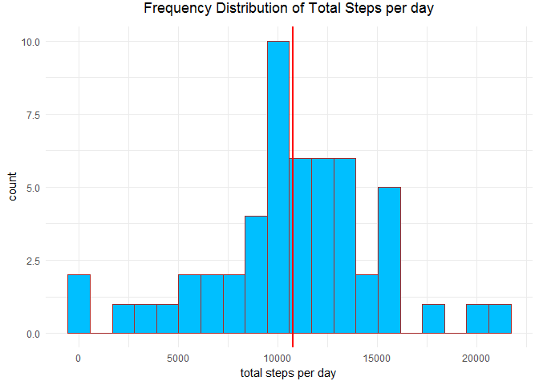
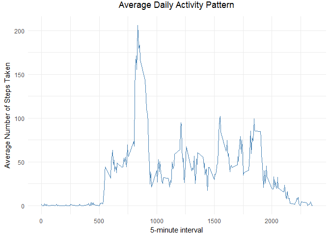
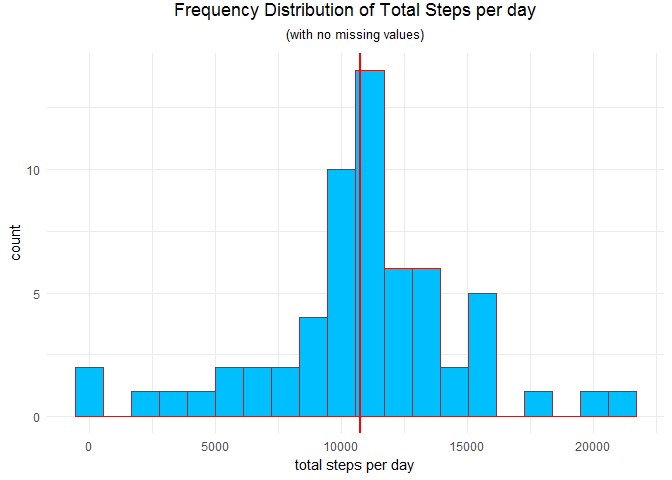
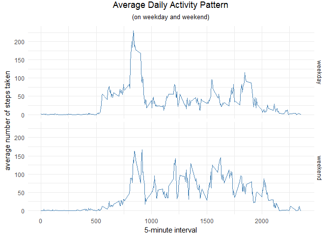

## Loading and preprocessing the data


```r
setwd('D:/我的文档/Coursera/Data Science/Reproducible Research')
if(!file.exists("PA1")){ dir.create("PA1")}
```


```r
if(!file.exists("./PA1/Activity monitoring data.csv")){
  fileUrl <- "https://d396qusza40orc.cloudfront.net/repdata%2Fdata%2Factivity.csv"
  download.file(fileUrl, destfile = "./PA1/Activity monitoring data.csv")
}
filename <- "Activity monitoring data.csv"
dateDownloaded <- date()
```

Download the data from the course website at **Mon Mar 26 15:18:51 2018** and rename the original data as **Activity monitoring data.csv**. Then load the data into the working environment.


```r
active <- read.csv("./PA1/Activity monitoring data.csv", sep = ",", header = TRUE)
dataname <- "active"
head(active)
```

```
##   steps       date interval
## 1    NA 2012-10-01        0
## 2    NA 2012-10-01        5
## 3    NA 2012-10-01       10
## 4    NA 2012-10-01       15
## 5    NA 2012-10-01       20
## 6    NA 2012-10-01       25
```

Name the loaded dataframe as active.

## What is mean total number of steps taken per day? (with missing values)


```r
# 1.1
total_per <- aggregate(steps~date, active, sum, na.action = na.omit)
head(total_per, n = 10)
```

```
##          date steps
## 1  2012-10-02   126
## 2  2012-10-03 11352
## 3  2012-10-04 12116
## 4  2012-10-05 13294
## 5  2012-10-06 15420
## 6  2012-10-07 11015
## 7  2012-10-09 12811
## 8  2012-10-10  9900
## 9  2012-10-11 10304
## 10 2012-10-12 17382
```

```r
# 1.3
mean_nas <- with(total_per, mean(steps, na.rm = T))
mean_nas
```

```
## [1] 10766.19
```

```r
median_nas <- with(total_per, median(steps, na.rm = T))
median_nas
```

```
## [1] 10765
```

```r
# 1.2
library(ggplot2)
ggplot(total_per, aes(steps)) + geom_histogram(
        na.rm = T,
        bins = 20,
        fill = "deepskyblue",
        color = "brown"
) + theme_minimal() + xlab("total steps per day") + ggtitle("Frequency Distribution of Total Steps per day") + theme(plot.title = element_text(hjust =0.5, vjust = 3)) + geom_vline(xintercept = mean_nas, size = 1, col = 'purple') + geom_vline(xintercept = median_nas, size = 1, col = 'red')
```

<!-- -->

We can see that ignoring all the missing values, the mean total number of steps taken per day is nearly **10766** steps, and the corresponding median is approximately **10765** steps. We can see from the plot that they are almost the same. Total number of steps taken per day is stored in the data.frame `total_per`.

## What is the average daily activity pattern?


```r
# 2.1
a <- aggregate(steps~interval, active, mean, na.action = na.omit)
ggplot(a, aes(x=interval, y=steps)) + geom_line(colour = "steelblue") + theme_minimal() + xlab("5-minute interval") + ylab("Average Number of Steps Taken") + ggtitle("Average Daily Activity Pattern") + theme(plot.title = element_text(hjust =0.5, vjust = 3))
```

<!-- -->

```r
# 2.2
b <- with(a, a[steps == max(steps, na.rm = T),])
interval_max <- b[1,1]
interval_max
```

```
## [1] 835
```

```r
rm(b)
```

The 5-minute interval, on average across all the days in the dataset, that contains the maximum number of steps is the interval **835**.

## Imputing missing values


```r
# 3.1
num_rows_na <- sum(rowSums(is.na(active))>0)
num_rows_na
```

```
## [1] 2304
```

```r
col_na <- colnames(active)[colSums(is.na(active)) > 0]

# 3.2 imputing missing values with average steps taken of that interval
active_na <- active[rowSums(is.na(active)) > 0, ]
active_c <- active[rowSums(is.na(active)) == 0, ]
active_na <- active_na[, -1]
library(plyr)
active_na <- join(active_na, a, by='interval', type='left', match='all')
rm(a)

# 3.3
active_complete <- rbind(active_na, active_c)
rm(active_c, active_na)
```

The total number of rows with missing values is **2304** and we can see that the only column with missing values is the column **steps**. With the missing values filled up with the average steps taken of any specific interval, the new dataset is stored as `active_complete`.


```r
total_per_complete <- aggregate(steps~date, active_complete, sum)

mean_complete <- with(total_per_complete, mean(steps))
mean_complete
```

```
## [1] 10766.19
```

```r
median_complete <- with(total_per_complete, median(steps))
median_complete
```

```
## [1] 10766.19
```

```r
ggplot(total_per_complete, aes(steps)) + geom_histogram(
        na.rm = T,
        bins = 20,
        fill = "deepskyblue",
        color = "brown"
) + theme_minimal() + xlab("total steps per day") + ggtitle("Frequency Distribution of Total Steps per day", subtitle = "(with no missing values)") + theme(plot.title = element_text(hjust =0.5, vjust = 3), plot.subtitle = element_text(hjust =0.5, vjust = 3)) + geom_vline(xintercept = mean_complete, size = 1, col = 'purple') + geom_vline(xintercept = median_complete, size = 1, col = 'red') 
```

<!-- -->

With the new dataset, we can see that **8** days are added after filling up the missing values. There is no difference in the average steps taken per day, but the median chages from **10765** to **10766**, which is identical to the mean. The reason of this fact might be that steps taken on the added days are identical to the mean and they are nearly at the center of the distribution of total steps taken per day.

## Are there differences in activity patterns between weekdays and weekends?


```r
# 4.1
active_complete$date <- as.POSIXct(active_complete$date,format='%Y-%m-%d')
library(dplyr, warn.conflicts = F)
active_complete <- active_complete %>%
        mutate(day = weekdays(date),
               day = ifelse(day == "星期六" | day == "星期日",
                            "weekend",
                            "weekday"),
               day = factor(day, levels = c("weekday", "weekend")))
```


```r
# 4.2
a <- aggregate(steps ~ interval + day, active_complete, mean)
ggplot(a, aes(x=interval, y=steps)) + geom_line(colour = "steelblue") + facet_grid(day~.) + theme_minimal() + xlab("5-minute interval") + ylab("average number of steps taken") + ggtitle("Average Daily Activity Pattern", subtitle = "(on weekday and weekend)") + theme(plot.title = element_text(hjust =0.5, vjust = 3), plot.subtitle = element_text(hjust =0.5, vjust = 3))
```

<!-- -->
